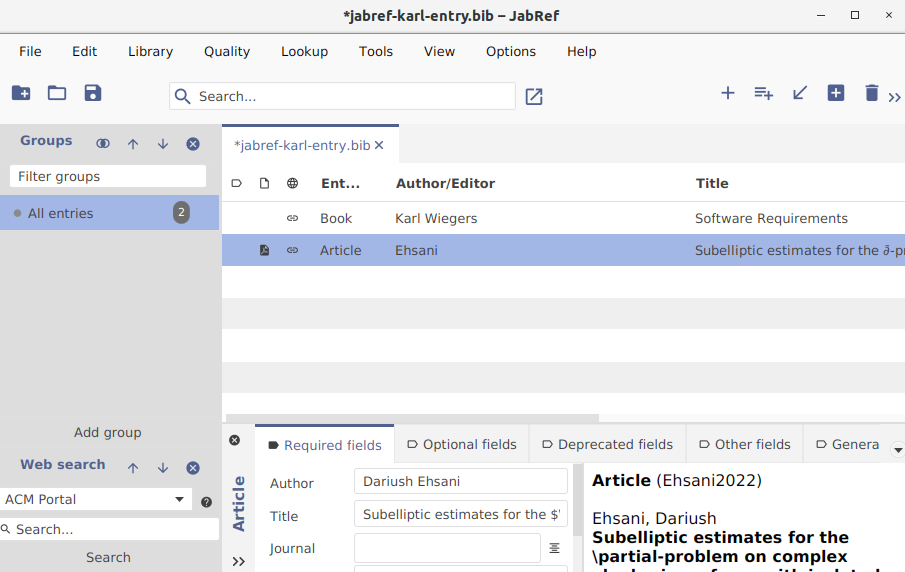
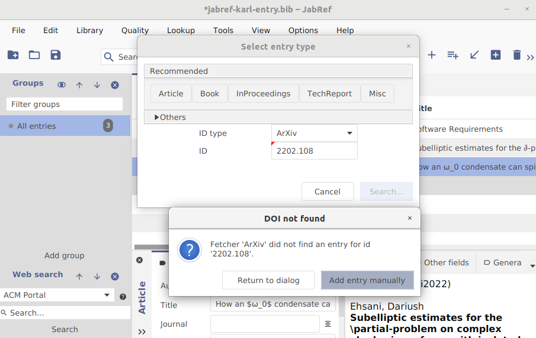
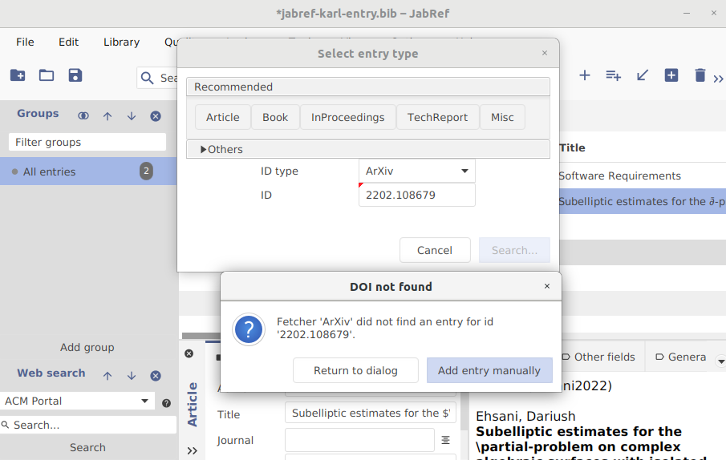
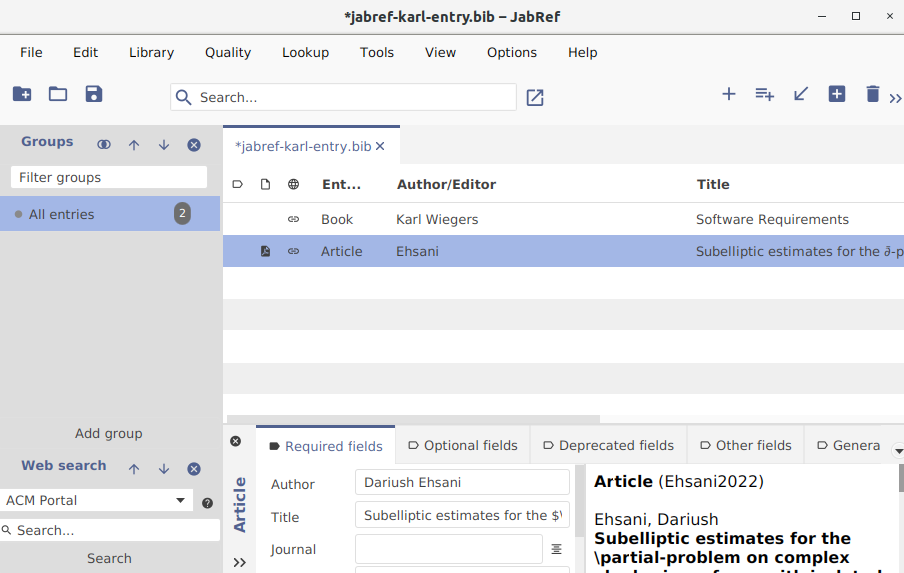
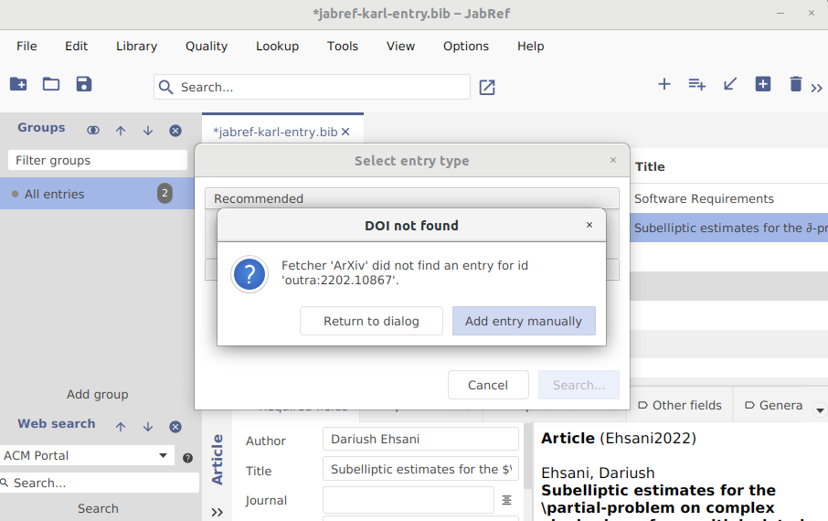
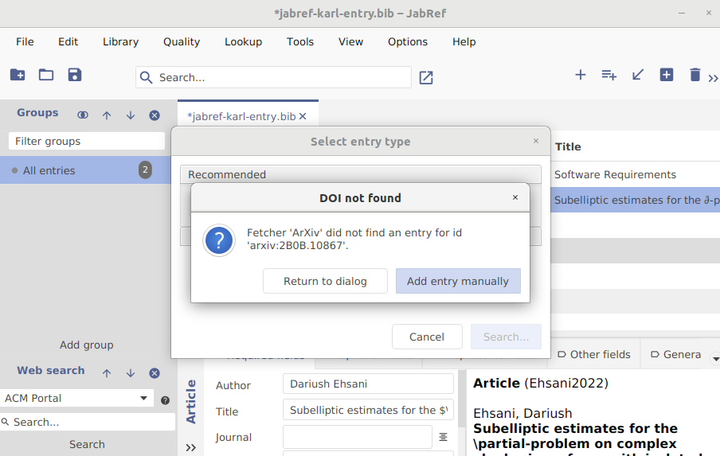

**Disciplina**: Testes de Software - Turma A

**Professora**: Elaine Venson

**Matrícula**: 160140410

**Aluno**: Yudi Yamame

<!-- 
Link de entrega parcial:
https://aprender3.unb.br/mod/assign/view.php?id=677989

Link da atividade:
https://aprender3.unb.br/mod/assign/view.php?id=677981

Objetivo: realizar testes funcionais na aplicação.

Instruções:

Defina o projeto OSS a ser utilizado na atividade. Preencha o nome e a URL do GitHub na planilha "Equipes - Turma A" no Teams.
Navegue pela documentação do usuário do projeto e escolha uma funcionalidade para testar. Cada membro da equipe deve escolher uma funcionalidade distinta dos demais. A funcionalidade deve ser minimamente complexa para gerar ao menos 6 casos de teste.
Leia atentamente a especificação da funcionalidade e identifique as condições de entrada e as condições de saída. Observe que a maioria dos projetos não terá uma especificação explícita. De forma geral, informações sobre o comportamento esperado das funcionalidades podem ser encontradas no manual do usuário, wiki, site de documentação ou outras ferramentas utilizadas pelo projeto. Na falta de informações claras, a equipe pode utilizar o bom senso e fazer suposições sobre as condições de entrada.
A partir das condições de entrada e de saída, identifique as classes de equivalência válidas e inválidas.
Escreva casos de teste cobrindo o máximo de classes válidas, aplicando as técnicas de particionamento de equivalência e análise de valor limite.
Escreva um caso de teste para cada classe inválida, aplicando a análise de valor limite.
Execute os casos de teste e reporte os resultados da execução.
Entrega:

Relatório contendo as seguintes informações:

Identificação da funcionalidade escolhida e especificação da funcionalidade (pode ser copiado da documentação ou escrita por você).
Tabela com as condições de entrada, identificando e numerando as classes válidas e inválidas.
Especificação dos casos de teste. Cada caso de teste deve apresentar: número do caso de teste, quais classes de equivalência está cobrindo, dados de entrada, saída esperada e procedimento para executar o teste (passo-a-passo para executar a funcionalidade com os dados de entrada).
Resultados da execução: cada caso de teste deve apresentar as seguintes informações: resultado geral (sucesso ou falha) e no caso de falha qual o resultado obtido que é diferente do esperado.
Capturas de tela mostrando a execução dos testes (telas com os dados de entrada, telas com os dados de saída e telas intermediárias se necessário).
 -->

# Projeto Open Source

O projeto escolhido pelo grupo foi o [JabRef](https://github.com/JabRef/jabref).
Os testes podem ser executados rodando

# Funcionalidade

Não determinei a funcionalidade específica mas estou entre alugmas das funcionalidades
das actions como `NewEntryAction`  usando o formato de identificação do ArXiv.

## Formato ArXiv

Formato geral de entrada: `arXiv:YYMM.number{vV}`, onde `vV` é a versão (`v1`, `v2` etc)
e é opicional. A especificação dos campos é a seguinte:

- `YY` is the two-digit year (07=2007 through 99=2099, and potentially up to 06=2106)
- `MM` is the two-digit month number (01=Jan,...12=Dec)
- `number` is a zero-padded sequence number of 4- or 5-digits. From 0704 through 1412
it is 4-digits, starting at `0001`. From 1501 on it is 5-digits, starting at `00001`. 
5-digits permits up to 99999 submissions per month. We cannot currently anticipate 
more than 99999 submissions per month although extension to 6-digits would be possible.
- `vV` is a literal v followed by a version number of 1 or more digits starting at `v1`.

[Fonte](https://arxiv.org/help/arxiv_identifier#new)

## Condições de entrada | Classes de equivalência

| Condição de entrada                    | Classes válidas   | Classes inválidas     |
| -------------------------------------- | ----------------- | --------------------- |
| Tamanho do campo `number`              | 4 \<= T \<= 5 (1) | T \< 3 (2), 5 < T (3) |
| Contém letras nos campos `YY` ou `MM`  | Não (4)           | Sim (5)               |
| Contém prefixo `arxiv:`                | Sim (6), Não (7)* |                       |
| Contém um prefixo diferente de `arxiv` |                   | Sim (8)               |

\* O campo de pesquisa do JabRef aceita a entrada com ou sem o prefixo `arxiv`.

## Casos de teste

| Número | Entrada            | Saída esperada                     | Classes de equivalência |
| ------ | ------------------ | ---------------------------------- | ----------------------- |
| 1      | `2202.10867`       | Adicionar entrada à biblioteca     | 7, 1                    |
| 2      | `2202.1086`        | Entrada com ID dado não encontrado | 2                       |
| 3      | `2202.108679`      | Entrada com ID dado não encontrado | 3                       |
| 4      | `arxiv:2202.10867` | Adicionar entrada à biblioteca     | 6                       |
| 5      | `outra:2202.10867` | Entrada com ID dado não encontrado | 8                       |
| 6      | `arxiv:2B0B.10867` | Entrada com ID dado não encontrado | 5                       |

## Execução e resultados

### Caso de teste 1

{ width="400" }

### Caso de teste 2

{ width="400" }

### Caso de teste 3

{ width="400" }

### Caso de teste 4

{ width="400" }

### Caso de teste 5

{ width="400" }

### Caso de teste 6

{ width="400" }

