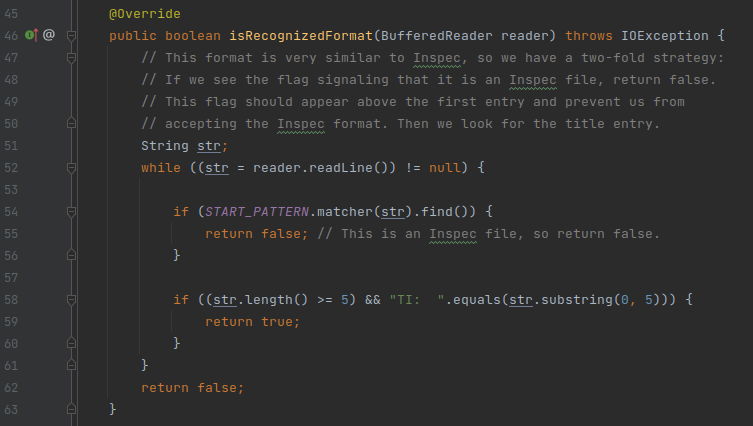

<!--
./sh/md2pdf src/mod3-unit-test/atividade-3-2-novos-testes-de-unidade/atividade-3-2-novos-testes-de-unidade-yudi-yamane.md 

Lista de exercícios:

Link da entrega:
https://aprender3.unb.br/mod/assign/view.php?id=687602

-->

**Disciplina**: Testes de Software

**Professor**: Elaine Venson

**Matrícula**: 160140410

**Aluno**: Yudi Yamame

<!--
csv to markdown 
- https://blog.lent.ink/post/start-coding/
- https://stackoverflow.com/questions/41690802/convert-csv-file-contents-to-markdown
- https://github.com/mplewis/csvtomd

csvtomd conditions.csv | xclip -selection c
 -->

## Código

`src/main/java/org/jabref/logic/util/strings/StringManipulator.java`

método `SilverPlatterImporter.isRecognizedFormat(BufferedReader reader)`

Classe: `SilverPlatterImporter`

Caminho: `src/main/java/org/jabref/logic/importer/fileformat/SilverPlatterImporter.java`

Link: [yudi-azvd/jabref](https://github.com/yudi-azvd/jabref)

## Testes existentes

Testes existes estão no arquivo [`SilverPlatterImporterTest.java`](https://github.com/yudi-azvd/jabref/blob/main/src/test/java/org/jabref/logic/importer/fileformat/SilverPlatterImporterTest.java)
.

## Tabela de condições

<!-- 
Link da planilha:
https://docs.google.com/spreadsheets/d/14dO35E1V3v2mx9WWJAip2BABqZEFTjRo-XYvRG7nvqQ/edit#gid=1008933058
 -->

.

## Especificação dos casos de teste

| ID  | Condições cobertas | Entrada (str)               | Saída esperada |
| --- | ------------------ | --------------------------- | -------------- |
| 1   | 54.V               | `"Record..stuff..INSPEC\n"` | Falso          |
| 2   | 54.F               | `"UT INSPEC:777777\n"`      | Falso          |
| 3   | 58.1.F, 58.2.V     | Impossível                  | Falso          |
| 4   | 58.1.F, 58.2.F     | `"FA:  \n"`                 | Falso          |
| 5   | 58.1.V, 58.2.F     | `"..."`                     | Falso          |
| 6   | 58.1.V, 58.2.V     | `"TI:       \n"`            | Verdadeiro     |

Todos os casos de teste da tabela anterior cobrem a condição da linha 52, por
isso foi omitido na tabela.

A combinação 58.1.F, 58.2.V é impossível por que `str.substring(0, 5)`
não faz sentido se `str` é uma string com menos de 5 caracteres.

## Código fonte dos testes

[Link](https://github.com/yudi-azvd/jabref/blob/main/src/test/java/org/jabref/logic/importer/fileformat/MySilverPlatterImporterTest.java)
para o código no GitHub.

## Resultado dos testes

Os testes deram certo.

