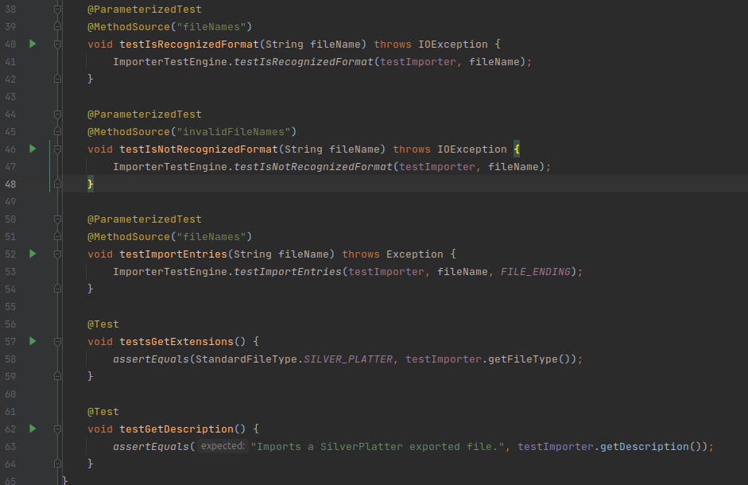

<!--
./sh/md2pdf src/mod3-unit-test/atividade-3-2-novos-testes-de-unidade/atividade-3-2-novos-testes-de-unidade-yudi-yamane.md 

Lista de exercícios:

Link da entrega:
https://aprender3.unb.br/mod/assign/view.php?id=687602

-->

**Disciplina**: Testes de Software

**Professor**: Elaine Venson

**Matrícula**: 160140410

**Aluno**: Yudi Yamame

<!--
csv to markdown 
- https://blog.lent.ink/post/start-coding/
- https://stackoverflow.com/questions/41690802/convert-csv-file-contents-to-markdown
- https://github.com/mplewis/csvtomd

csvtomd conditions.csv | xclip -selection c
 -->

## Código

`src/main/java/org/jabref/logic/util/strings/StringManipulator.java`

método `SilverPlatterImporter.isRecognizedFormat(BufferedReader reader)`

Classe: `SilverPlatterImporter`

Caminho: `src/main/java/org/jabref/logic/importer/fileformat/SilverPlatterImporter.java`

Link: [yudi-azvd/jabref](https://github.com/yudi-azvd/jabref)

## Testes existentes

## Tabela de condições

<!-- 
Link da planilha:
https://docs.google.com/spreadsheets/d/14dO35E1V3v2mx9WWJAip2BABqZEFTjRo-XYvRG7nvqQ/edit#gid=1008933058
 -->

| ID   | Condição                           | Situação para V | Situação para F |
|------|------------------------------------|-----------------|-----------------|
|   52 | (str = reader.readLine()) != null  |                 |                 |
|   54 | START_PATTERN.matcher(str).find()  |                 |                 |
| 58.1 | str.length() >= 5                  |                 |                 |
| 58.2 | "TI: ".equals(str.substring(0, 5)) |                 |                 |

## Especificação dos casos de teste

## Código fonte dos testes

## Resultado dos testes

