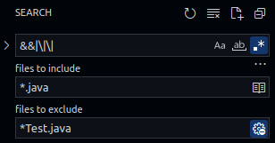
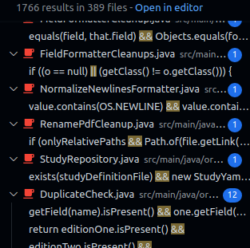

# Candidatos

Regex que eu usei pra substituir caminhos à direta pelo nome do arquivo:
`:.*/(\w+\.java)$`.

| Complexidade | Identificador |
| ------------ | ------------- |
| Baixíssima   | 0             |
| Baixa        | 1             |
| Média        | 2             |
| Alta         | 3             |
| Altaaa       | 4             |
| Altíssima    | 5             |

- `[0]` `HowPublishedChecker.checkValue`
- `[0]` `SilverPlatterImporter.isRecognizedFormat`
- `[0]` `WrapFileLinks.setArgument`
- `[1]` `CitationKeyChecker.check`
- `[1]` `CustomExternalFileType.buildFromArgs`
- `[1]` `FileDialogConfiguration.withInitialDirectory`
- `[1]` `FileFieldWriter.quote`
- `[1]` `IfPlural.format`
- `[1]` `Localization.setLanguage`
- `[1]` `MainTableColumnModel.parse`
- `[1]` `NormalizeNewlinesFormatter.format`
- `[1]` `NormalizePagesFormatter.format`
- `[1]` `NumericFieldComparator.compare`
- `[1]` `NumericFieldComparator.isNumber`
- `[1]` `PageInfo.comparePageInfo`
- `[1]` `PageInfo.normalizePageInfo`
- `[1]` `RemoveTilde.format`
- `[1]` `RemoveWhiteSpace.format`
- `[2]` `AbstractPushToApplication.pushEntries`
- `[2]` `Authors.format`
- `[2]` `BibtexDatabaseWriter.writeString`
- `[2]` `BibtexNameFormatter.getFirstCharOfString`
- `[2]` `CreateModifyExporterDialogViewModel.saveExporter`
- `[2]` `DefaultLatexParser.parse(List<Path> latexFiles)`
- `[2]` `EditionChecker.checkValue`
- `[2]` `KeyBindingViewModel.setNewBinding`
- `[2]` `NameFormatter.format`
- `[2]` `ParserResultWarningDialog.showParserResultWarningDialog`
- `[2]` `ProxyAuthenticator.getPasswordAuthentication`
- `[2]` `RemoveBracesFormatter.format`
- `[2]` `UpdateCitationMarkers.applyNewCitationMarkers`
- `[2]` `UpdateField.updateField(BibEntry, Field, String, Boolean)`
- `[2]` `URLDownload.getMimeType`
- `[3]` `ProtectedTermsLoader.update`
- `[3]` `SentenceAnalyzer.getWords`
- `[3]` `StringUtil.intValueOptional`:504 muitas condições nessa linh
- `[3]` `URLUtil.getSuffix`
- `[4]` `Author.addDotIfAbbreviation`
- `[5]` `OOBibStyle.getNumCitationMarker`
- `[5]` `OOUtilinsertOOFormattedTextAtCurrentLocation`
- `[5]` `RTFChars.format`
- `[5]` `WrapFileLinks.format`

A ordenação por complexidade está longe de estar rigorasamente precisa, mas dá uma noção geral.

## Como eu cheguei nessa lista

_Pra quem estiver curioso_.

### Complexidade

`[0]` - Baxíssima: basicamente dois `if`s e um deles tem duas condições

`[1]` - Baixa: poucas decisões/condições e usa poucos objetos não nativos do java

`[3]` - Alta: muitas decisões/condições e usa muitos objetos não nativos do java

`[5]` - Altíssima: _**muitas**_ decisões/condições. Mal cabe na tela

### Pesquisa

Pra encontrar esse métodos comecei pelo Pesquisador do VSCode <kbd>Ctrl</kbd>
+<kbd>Shift</kbd>+ <kbd>F</kbd>. 

Coloquei no campo de pesquisa: `&&|\|\|`.

Arquivos para serem incluídos: `*.java`

Arquivos para serem excluídos: `*Test.java`

E foram mais 1700 resultados. Não cheguei a olhar todos os
resultados. Alguns eu só pulei mesmo

### Critérios de seleção

A partir daí fui clicando nos vários resultados e usando mais ou menos os
seguintes filtros:

- Método tem que ser público ou protegido
- Método não pode usar `lambda function` (não sei o por quê)
- Método não pode ser construtor (também não sei o por quê)
- Tem que ter mais de uma decisão
- Tem que ter pelo menos uma decisão com mais de uma condição
- Método tem que "caber" no monitor
- Não pode ser um override de `.equals`
- Não pode ter muitos `||` ou `&&` na mesma decisão, acima de 4