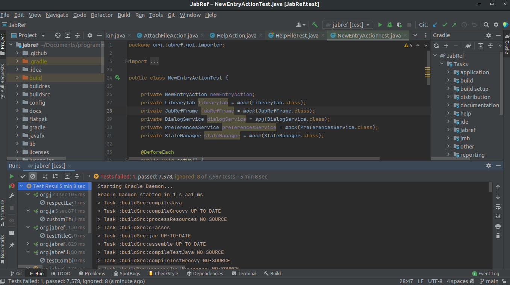

<!-- 

link para entrega:
https://aprender3.unb.br/mod/assign/view.php?id=684634

Instruções:

Navegar no GitHub e entender a estrutura do projeto
Ler manual/instruções de contribuição com o projeto
Ler documentação existente sobre a arquitetura do projeto (verificar wiki no GitHub ou site de documentação ou repositório de documentação)
Ler documentação sobre a configuração de ambiente de desenvolvimento projeto
Fazer um fork do projeto
Configurar ambiente de desenvolvimento do projeto

Entregáveis:

Links das documentações encontradas
Link do fork do projeto
Captura de tela do ambiente de desenvolvimento (IDE com projeto aberto)
Breve texto sobre as suas impressões sobre a documentação
-->

**Disciplina**: Testes de Software - Turma A

**Professora**: Elaine Venson

**Matrícula**: 160140410

**Aluno**: Yudi Yamame

# Familiarização com a estrutura do projeto - JabRef

## Links das documentações

- [Como contribuir](https://github.com/JabRef/jabref/blob/main/CONTRIBUTING.md)
- [Set up a local workspace](https://devdocs.jabref.org/getting-into-the-code/guidelines-for-setting-up-a-local-workspace)
- [Documentação em alto nível](https://devdocs.jabref.org/getting-into-the-code/high-level-documentation)
- [Como testar casos de teste](https://devdocs.jabref.org/getting-into-the-code/code-howtos#test-cases)
- [JabRef's development strategy](https://devdocs.jabref.org/getting-into-the-code/development-strategy)
- [Links para decisões de arquitetura](https://devdocs.jabref.org/adr)

## Link do fork

[yudi-azvd/jabref](https://github.com/yudi-azvd/jabref)

## Ambiente de desenvolvimento + IDE com projeto aberto

{ width="600" }

## Minha impressões

A documentação parece ser bem rica, o que cria um ambiente convidativo
pra inciantes e inexperientes. Também não parece ter uma ordem de leitura dos
documentos, o que pode ser um pouco confuso, mas isso deve ser normal no mundo 
open source.