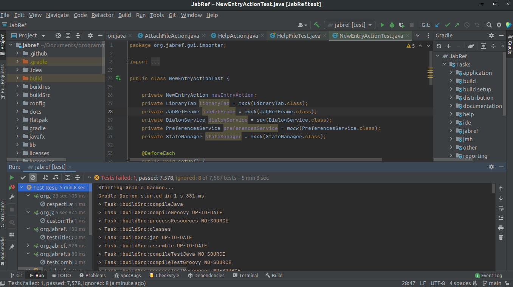
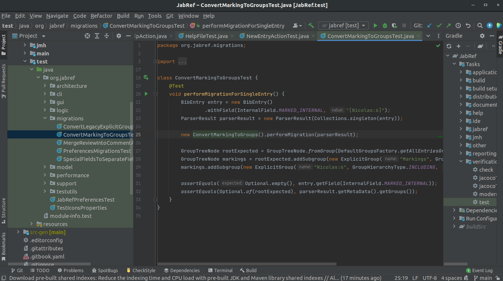
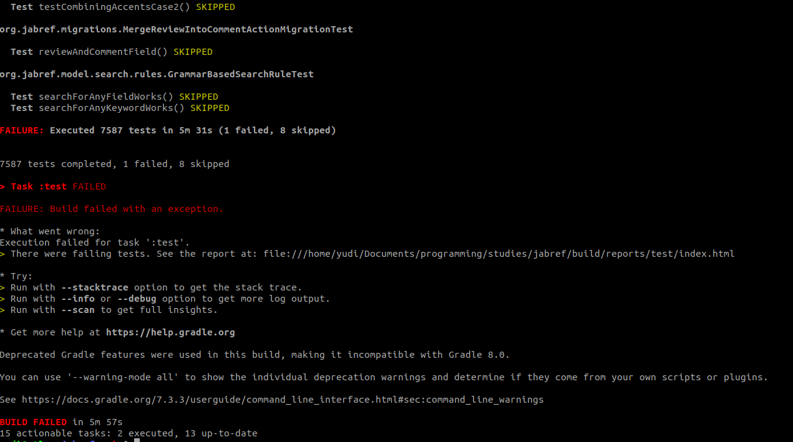
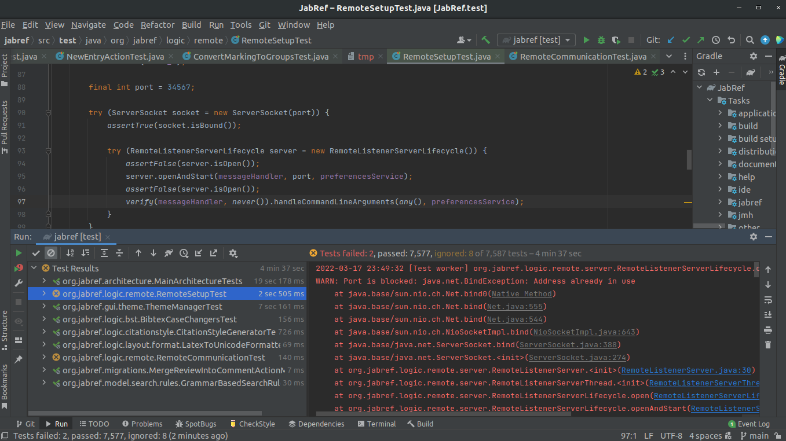

<!--
Link da entrega:
https://aprender3.unb.br/mod/assign/view.php?id=687591
-->

**Disciplina**: Testes de Software

**Professor**: Elaine Venson

**Matrícula**: 160140410

**Aluno**: Yudi Yamame


# Executar testes de unidade

## Fork no GitHub
Fork: [yudi-azvd/jabref](https://github.com/yudi-azvd/jabref)

## JabRef na IDE



## Classes de teste de unidade

Na Figura \ref{fig:tests}, alguns testes são exibidos à esquerda na árvores
de arquivos do Intellij.



Executando o comando

```sh
find . -type f -name "*Test.java" | wc -l
```

Na raíz do projeto, podemos ver todas as classes de teste totalizando 450 arquivos
de testes. Algumas dessas classes são as seguintes:

- ./src/test/java/org/jabref/testutils/category/GUITest.java
- ./src/test/java/org/jabref/testutils/category/FetcherTest.java
- ./src/test/java/org/jabref/testutils/category/DatabaseTest.java
- ./src/test/java/org/jabref/gui/preview/CopyCitationActionTest.java
- ./src/test/java/org/jabref/gui/importer/NewEntryActionTest.java
- ./src/test/java/org/jabref/gui/importer/fetcher/WebSearchPaneViewModelTest.java
- ./src/test/java/org/jabref/gui/search/ContainsAndRegexBasedSearchRuleDescriberTest.java
- ./src/test/java/org/jabref/gui/search/GrammarBasedSearchRuleDescriberTest.java
- ./src/test/java/org/jabref/gui/mergeentries/DiffHighlightingTest.java
- ./src/test/java/org/jabref/gui/documentviewer/PdfDocumentViewModelTest.java
- ./src/test/java/org/jabref/gui/preferences/journals/JournalAbbreviationsViewModelTabTest.java
- ./src/test/java/org/jabref/gui/preferences/journals/AbbreviationViewModelTest.java
- ./src/test/java/org/jabref/gui/preferences/keybindings/KeyBindingViewModelTest.java
- ./src/test/java/org/jabref/gui/entryeditor/SourceTabTest.java
- ./src/test/java/org/jabref/gui/entryeditor/fileannotationtab/FileAnnotationViewModelTest.java
- ./src/test/java/org/jabref/gui/autocompleter/FieldValueSuggestionProviderTest.java
- ./src/test/java/org/jabref/gui/autocompleter/AppendPersonNamesStrategyTest.java
- ./src/test/java/org/jabref/gui/autocompleter/DefaultAutoCompleterTest.java
- ./src/test/java/org/jabref/gui/autocompleter/SuggestionProvidersTest.java
- ./src/test/java/org/jabref/gui/autocompleter/PersonNameStringConverterTest.java
- ./src/test/java/org/jabref/gui/autocompleter/BibEntrySuggestionProviderTest.java
- ./src/test/java/org/jabref/gui/autocompleter/PersonNameSuggestionProviderTest.java
- ./src/test/java/org/jabref/gui/autocompleter/ContentSelectorSuggestionProviderTest.java
- ./src/test/java/org/jabref/gui/contentselector/ContentSelectorDialogViewModelTest.java
- ./src/test/java/org/jabref/gui/keyboard/KeyBindingsTabModelTest.java
- ./src/test/java/org/jabref/gui/edit/ManageKeywordsViewModelTest.java
- ./src/test/java/org/jabref/gui/edit/ReplaceStringViewModelTest.java
- ./src/test/java/org/jabref/gui/edit/CopyMoreActionTest.java

## Resultado dos testes

Os testes podem ser executados pelo terminal com

    ./gradlew test

E o resultado pode ser observado na Figura \ref{fig:results}. Foram executados
ao todo 7587 testes, dos quais 8 testes foram _pulados_ como `customThemeBecomesAvailableAfterFileIsCreated`,
`testTitleCaseAllUppers`, `testHandleAmpersand` e `testCombiningAccentsCase2`. Além
disso, 1 teste falhou: `RemoteSetupTest.testPortAlreadyInUse`.



Um resultado ligeiramente diferente é obtido executando os testes pelo Intellij, 
como pode ser observado na Figura \ref{fig:results-ide}. 8 testes continuam sendo
pulados, mas 2 testes falharam. São esses 

- `RemoteSetupTest.testPortAlreadyInUse`
- `RemoteCommunicationTest.commandLineArgumentEncodingAndDecoding`



A descrição do erro em `RemoteSetupTest.testPortAlreadyInUse` é

```
Test testPortAlreadyInUse() FAILED

org.mockito.exceptions.misusing.InvalidUseOfMatchersException: 
Invalid use of argument matchers!
2 matchers expected, 1 recorded:
-> at org.jabref.logic.remote.RemoteSetupTest.testPortAlreadyInUse(RemoteSetupTest.java:97)

This exception may occur if matchers are combined with raw values:
    //incorrect:
    someMethod(any(), "raw String");
When using matchers, all arguments have to be provided by matchers.
For example:
    //correct:
    someMethod(any(), eq("String by matcher"));
```
<br>


Essa mensagem indica que exite um erro na maneira que o método `handleCommandLineArguments`
está sendo chamado. Atualmente, a linha 97 está assim

```
verify(messageHandler, never()).handleCommandLineArguments(any(), preferencesService);
```

Importando `org.mockito.Mockito.eq`, podemos usar `eq`

```
verify(messageHandler, never()).handleCommandLineArguments(any(), eq(preferencesService));
```

Minha versão está desatuzalida em relação ao repositório original. Lá esse erro
já foi corrigido.