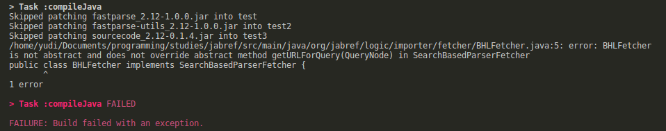
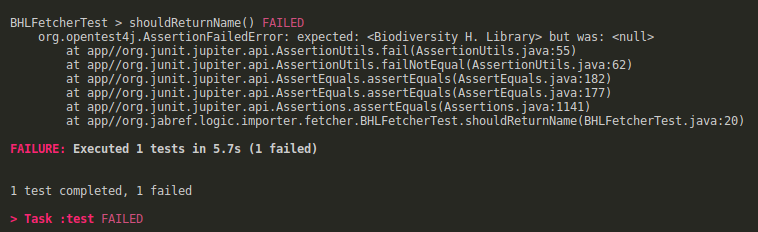
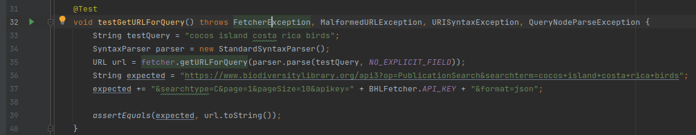
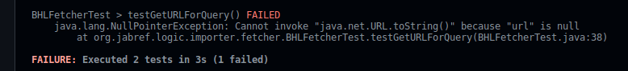
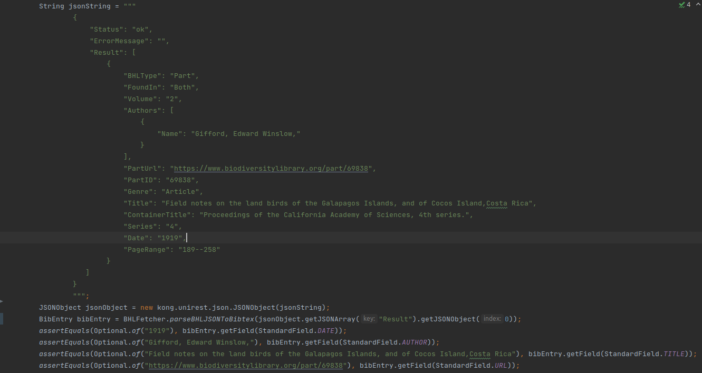
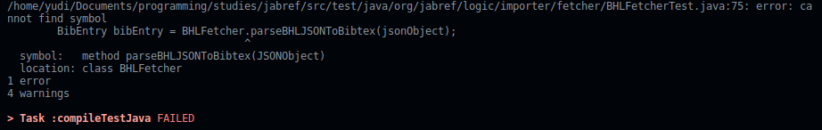
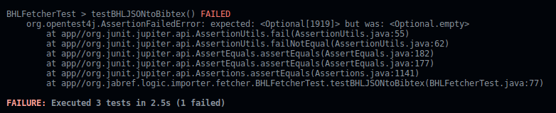
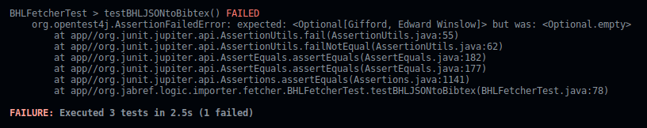
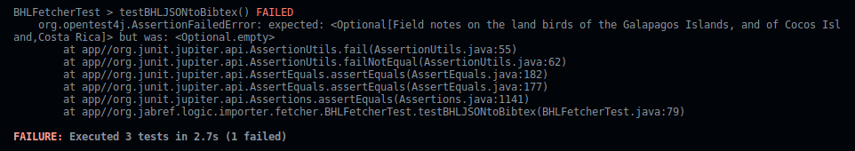

<!--
Link da entrega:
https://aprender3.unb.br/mod/assign/view.php?id=691625

-->

**Disciplina**: Testes de Software

**Professor**: Elaine Venson

**Matrícula**: 160140410

**Aluno**: Yudi Yamame

# Breve observação

É recomendado olhar no seu visualizador de PDF o outline do documento para navegar
facilmente entre os ciclos.

# Issue escolhida

Issue [#8539](https://github.com/JabRef/jabref/issues/8539) - Add 
www.biodiversitylibrary.org to the websearch options

## Especificação da issue

"A literatura mais antiga não é facilmente recuperada pelas bases de dados 
disponíveis (especialmente livros). Descreva a solução que você deseja. Adicione
https://www.biodiversitylibrary.org/bibliography aos bancos de dados disponíveis
para auxiliar na busca de material (neste caso, biologia)."

## Descrição da funcionalidade a ser desenvolvida

(Essa parte é igual à entrega parcial 1. Pode pular)

A nova funcionalidade deve adicionar a possibilidade de usar a Biodiversity Heritage 
Library (BHL) como banco de dados para pesquisa. A classe a ser desenvolvida
deve implementar a interface `SearchBasedFetcher` ou alguma de suas extensões:
`SearchBasedFetcher`, `SearchBasedParserFetcher`, `PagedSearchBasedFetcher` ou
`PagedSearchBasedParserFetcher`. Segundo um dos comentários da issue, a interface
provável é a `SearchBasedParserFetcher`.

A orientação geral para desenvolvedores pode ser encontrada 
[aqui](https://about.biodiversitylibrary.org/tools-and-services/developer-and-data-tools/#APIs)
e a documentação da API [aqui](https://www.biodiversitylibrary.org/docs/api3.html#top).

A API do BHL fornece apenas o que foi pedido na pesquisa para devolver informações
desnecessárias ao usuário. O usuário da API deve realizar chamadas em sucessão para
obter toda a informação que precisa.

# Requisitos

## Básico

- Deve retornar o nome ao ser invocado o método `.getName()`

## Autenticação

- Deve lançar uma exceção se a chave de API for inválida.
- Deve lançar uma exceção se a chave de API tiver permissão o suficiente para o 
método.

## Pesquisa

- Deve lançar uma exceção se o método escolhido não existir.
- Deve retornar os BibEntries para uma determinada pesquisa de publicações
com o método `PublicationSearch` da API através de `searchterm`s.
- Deve retornar BibEntry dado o ID de uma publicação.

## Observações

Até a próxima entrega serão adicionados mais requisitos. Vai ser possível 
entender melhor como funciona a API e seus mecanismos de pesquisa.

# Execução do TDD

## Ciclo 1

Requisito básico: deve retornar o nome ao ser invocado o método `.getName()`.

### Especificação do requisito em teste

Especificação do teste na figura \ref{fig:tdd-p2-c1-spec}.

{ width=600 }

Nesse ponto, `BHLFetcher` está assim

```java
package org.jabref.logic.importer.fetcher;
import org.jabref.logic.importer.SearchBasedParserFetcher;

public class BHLFetcher implements SearchBasedParserFetcher {

}
```

### Vermelho

Rodar os testes dão geram um erro de compilação, como mostrado na figura \ref{fig:tdd-p2-c1-red-1}:

{ width=600 }

Para compilar, `BHLFetcher` deve implementar corretamente a interface 
`SearchBasedParserFetcher`, o que resulta em:

```java
package org.jabref.logic.importer.fetcher;

import java.net.MalformedURLException;
import java.net.URISyntaxException;
import java.net.URL;
import org.jabref.logic.importer.FetcherException;
import org.jabref.logic.importer.Parser;
import org.jabref.logic.importer.SearchBasedParserFetcher;
import org.apache.lucene.queryparser.flexible.core.nodes.QueryNode;

public class BHLFetcher implements SearchBasedParserFetcher {
  @Override
  public Parser getParser() {
    return null;
  }

  @Override
  public URL getURLForQuery(QueryNode luceneQuery) throws URISyntaxException, 
    MalformedURLException, FetcherException 
  {
    return null;
  }

  @Override
  public String getName() {
    return null;
  }
}
```

Rodar os testes novamente resulta em um erro diferente, figura \ref{fig:tdd-p2-c1-red-2}.
Dessa vez está sendo dito que a string esperada é diferente da string resultante.

{ width=600 }

### Verde

Para fazer os testes passarem, basta modificar o método `getName()`


```java
package org.jabref.logic.importer.fetcher;

// import ...

public class BHLFetcher implements SearchBasedParserFetcher {
  // ...
  @Override
  public String getName() {
    return "Biodiversity H. Library";
  }
}
```

Rodando os testes agora passamos para a fase verde. Como o código até o momento
é muito simples, não é necessária refatoração ou limpeza.

Testar se o método `getURI<alguma-coisa>` retorna algo do tipo:

    https://www.biodiversitylibrary.org/api3?op=<method>...&apikey=<key+value>&format=json

## Ciclo 2

Requisito de pesquisa.

### Especificação do teste

{ width=600 }

### Vermelho

Rodar os testes resulta em

{ width=600 }

A `url` retornada na linha xx da figura \ref{fig:tdd-p2-c2-red-1} é nula porque 
o método ainda não foi implementado.

### Verde

Para fazer os testes passarem, foi implmentado o seguinte:

```java
public class BHLFetcher implements SearchBasedParserFetcher {
  final String API_KEY = new BuildInfo().bhlAPIKey;
  private final String SEARCH_URL = "https://www.biodiversitylibrary.org/api3?";

  // ...

  @Override
  public URL getURLForQuery(QueryNode luceneQuery) throws URISyntaxException, MalformedURLException,
   FetcherException 
  {
    URIBuilder uriBuilder = new URIBuilder(SEARCH_URL);
    uriBuilder.addParameter("op", "PublicationSearch");
    uriBuilder.addParameter("searchterm", new DefaultQueryTransformer().
      btransformLuceneQuery(luceneQuery).orElse(""));
    uriBuilder.addParameter("searchtype", "C");
    uriBuilder.addParameter("page", "1");
    uriBuilder.addParameter("pageSize", "10");
    uriBuilder.addParameter("apikey", API_KEY);
    uriBuilder.addParameter("format", "json");

    return uriBuilder.build().toURL();
  }
}
```

E os testes passaram.


## Ciclo 3

Converter resposta de JSON para para Bibtex.

### Especificação do teste

{ width=600 }

Esse teste verifica se parser consegue converter um objeto JSON em uma entrada Bib.
Esse JSON foi retirado de uma resposta da API. A parte principal da resposta
está no vetor `"Result"` (originalmente `"Result"` vem com vários objetos, mas deixei
apenas o primeiro para o caso de teste).


### Vermelho

Executar os testes resulta em um erro de compilação: o método `parseBHLJSONToBibtex`
não existe.

{ width=600 }


Implementando o mínimo do método `parseBHLJSONToBibtex` em `BHLFetcher` temos o seguinte

```java
public class BHLFetcher implements SearchBasedParserFetcher {
  // ...
  public static BibEntry parseBHLJSONToBibtex(JSONObject jsonObject) {
    BibEntry bibEntry = new BibEntry();
    return bibEntry;
  }
}
```

Rodar os testes novamente resulta em um erro de asserção:

{ width=600 }

A asserção falha porque o código implementado apenas retorna uma `BiBEntry` vazia.
Para corrigir isso, vamos acrecentar o seguinte código.


```java
public static BibEntry parseBHLJSONToBibtex(JSONObject jsonObject) {
  BibEntry bibEntry = new BibEntry();

  if (jsonObject.has("Result")) {
    JSONArray results = jsonObject.getJSONArray("Result");
    for (int i = 0; i < results.length(); i++) {
      if (results.getJSONObject(i).has("Date")) {
        bibEntry.setField(StandardField.DATE, results.getJSONObject(i).getString("Date"));
      }
    }
  }
  return bibEntry;
}
```

Agora o método `parseBHLJSONToBibtex` itera no vetor `"Result"`. Em uma pesquisa por termos,
esse vetor pode vir preenchido com vários objetos, por isso o loop é necessário.

Executar os testes retorna outro erro:

{ width=600 }

Aparentemente, o campo da data foi extraído corretamente. Agora a próxima asserção sobre o nome
do autor é que está falhando. O método foi modificado assim:

```java
public static BibEntry parseBHLJSONToBibtex(JSONObject jsonObject) {
  BibEntry bibEntry = new BibEntry();

  if (jsonObject.has("Result")) {
    JSONArray results = jsonObject.getJSONArray("Result");
    for (int i = 0; i < results.length(); i++) {
      if (results.getJSONObject(i).has("Date")) {
        bibEntry.setField(StandardField.DATE, results.getJSONObject(i).getString("Date"));
      }
      if (results.getJSONObject(i).has("Authors")) {
        JSONArray authors = results.getJSONObject(i).getJSONArray("Authors");
        List<String> authorsList = new ArrayList<>();
        for (int j = 0; j < authors.length(); j++) {
          if (authors.getJSONObject(j).has("Name")) {
            authorsList.add(authors.getJSONObject(i).getString("Name"));
          } else {
            LOGGER.info("Empty author name.");
          }
        }
        bibEntry.setField(StandardField.AUTHOR, String.join(" and ", authorsList));
      } else {
        LOGGER.info("No author found.");
      }
    }
  }
  return bibEntry;
}
```

O que mudou foi a verificação por um campo `"Authors"` na 
linha `if (results.getJSONObject(i).has("Authors")`.

Rodar os testes novamente resulta em outro erro:

{ width=600 }

O erro agora é sobre campo título. Vamos repetir esse processo para 
todos os campos restantes. O seguinte código faz os testees passarem.

```java
public static BibEntry parseBHLJSONToBibtex(JSONObject jsonObject) {
  BibEntry bibEntry = new BibEntry();

  if (jsonObject.has("Result")) {
    JSONArray results = jsonObject.getJSONArray("Result");
    for (int i = 0; i < results.length(); i++) {
      if (results.getJSONObject(i).has("Date")) {
        bibEntry.setField(StandardField.DATE, results.getJSONObject(i).getString("Date"));
      }
      if (results.getJSONObject(i).has("Authors")) {
        JSONArray authors = results.getJSONObject(i).getJSONArray("Authors");
        List<String> authorsList = new ArrayList<>();
        for (int j = 0; j < authors.length(); j++) {
          if (authors.getJSONObject(j).has("Name")) {
            authorsList.add(authors.getJSONObject(i).getString("Name"));
          } else {
            LOGGER.info("Empty author name.");
          }
        }
        bibEntry.setField(StandardField.AUTHOR, String.join(" and ", authorsList));
      } else {
        LOGGER.info("No author found.");
      }
      if (results.getJSONObject(i).has("Title")) {
          bibEntry.setField(StandardField.TITLE, results.getJSONObject(i).getString("Title"));
      }
      if (results.getJSONObject(i).has("PartUrl")) {
          bibEntry.setField(StandardField.URL, results.getJSONObject(i).getString("PartUrl"));
      }
      if (results.getJSONObject(i).has("Series")) {
          bibEntry.setField(StandardField.SERIES, results.getJSONObject(i).getString("Series"));
      }
      if (results.getJSONObject(i).has("Volume")) {
          bibEntry.setField(StandardField.VOLUME, results.getJSONObject(i).getString("Volume"));
      }
    }
  }
  return bibEntry;
}
```

