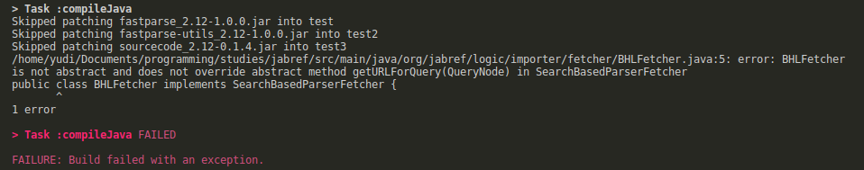

<!--
Link da entrega:
https://aprender3.unb.br/mod/assign/view.php?id=691625

-->

**Disciplina**: Testes de Software

**Professor**: Elaine Venson

**Matrícula**: 160140410

**Aluno**: Yudi Yamame


# Issue escolhida

Issue [#8539](https://github.com/JabRef/jabref/issues/8539) - Add 
www.biodiversitylibrary.org to the websearch options

## Especificação da issue

"A literatura mais antiga não é facilmente recuperada pelas bases de dados 
disponíveis (especialmente livros). Descreva a solução que você deseja. Adicione
https://www.biodiversitylibrary.org/bibliography aos bancos de dados disponíveis
para auxiliar na busca de material (neste caso, biologia)."

## Descrição da funcionalidade a ser desenvolvida

A nova funcionalidade deve adicionar a possibilidade de usar a Biodiversity Heritage 
Library (BHL) como banco de dados para pesquisa. A classe a ser desenvolvida
deve implementar a interface `SearchBasedFetcher` ou alguma de suas extensões:
`SearchBasedFetcher`, `SearchBasedParserFetcher`, `PagedSearchBasedFetcher` ou
`PagedSearchBasedParserFetcher`. Segundo um dos comentários da issue, a interface
provável é a `SearchBasedParserFetcher`.

A orientação geral para desenvolvedores pode ser encontrada 
[aqui](https://about.biodiversitylibrary.org/tools-and-services/developer-and-data-tools/#APIs)
e a documentação da API [aqui](https://www.biodiversitylibrary.org/docs/api3.html#top).

A API do BHL fornece apenas o que foi pedido na pesquisa para devolver informações
desnecessárias ao usuário. O usuário da API deve realizar chamadas em sucessão para
obter toda a informação que precisa.

# Requisitos

Nome provável da classe: `BHLFetcher`


## Básico

- Deve retornar o nome ao ser invocado o método `.getName()`

## Autenticação

- Deve lançar uma exceção se a chave de API for inválida.
- Deve lançar uma exceção se a chave de API tiver permissão o suficiente para o 
método.

## Pesquisa

- Deve lançar uma exceção se o método escolhido não existir.
- Deve retornar os BibEntries para uma determinada pesquisa de publicações
com o método `PublicationSearch` da API através de `searchterm`s.
- Deve retornar BibEntry para dado o ID de uma publicação.

## Observações

Até a próxima entrega serão adicionados mais requisitos. Vai ser possível 
entender melhor como funciona a API e seus mecanismos de pesquisa.

# Execução do TDD

## Ciclo 1

Requisito: deve retornar o nome ao ser invocado o método `.getName()`.

### Especificação do requisito em teste

Especificação do teste na figura \ref{fig:tdd-p2-c1-spec}.

{ width=600 }

Nesse ponto, `BHLFetcher` está assim

```java
package org.jabref.logic.importer.fetcher;
import org.jabref.logic.importer.SearchBasedParserFetcher;

public class BHLFetcher implements SearchBasedParserFetcher {

}
```

### Vermelho

Rodar os testes dão geram um erro de compilação, como mostrado na figura \ref{fig:tdd-p2-c1-red-1}:

{ width=600 }

Para compilar, `BHLFetcher` deve implementar corretamente a interface 
`SearchBasedParserFetcher`, o que resulta em:

```java
package org.jabref.logic.importer.fetcher;

import java.net.MalformedURLException;
import java.net.URISyntaxException;
import java.net.URL;
import org.jabref.logic.importer.FetcherException;
import org.jabref.logic.importer.Parser;
import org.jabref.logic.importer.SearchBasedParserFetcher;
import org.apache.lucene.queryparser.flexible.core.nodes.QueryNode;

public class BHLFetcher implements SearchBasedParserFetcher {
  @Override
  public Parser getParser() {
    return null;
  }

  @Override
  public URL getURLForQuery(QueryNode luceneQuery) throws URISyntaxException, MalformedURLException, FetcherException {
    return null;
  }

  @Override
  public String getName() {
    return null;
  }
}
```

Rodar os testes novamente resulta em um erro diferente, figura \ref{fig:tdd-p2-c1-red-2}.
Dessa vez está sendo dito que a string esperada é diferente da string resultante.

{ width=600 }

### Verde

Para fazer os testes passarem, basta modificar o método `getName()`


```java
package org.jabref.logic.importer.fetcher;

// import ...

public class BHLFetcher implements SearchBasedParserFetcher {
  // ...
  @Override
  public String getName() {
    return "Biodiversity H. Library";
  }
}
```

Rodar os testes agora passamos para a fase verde.

